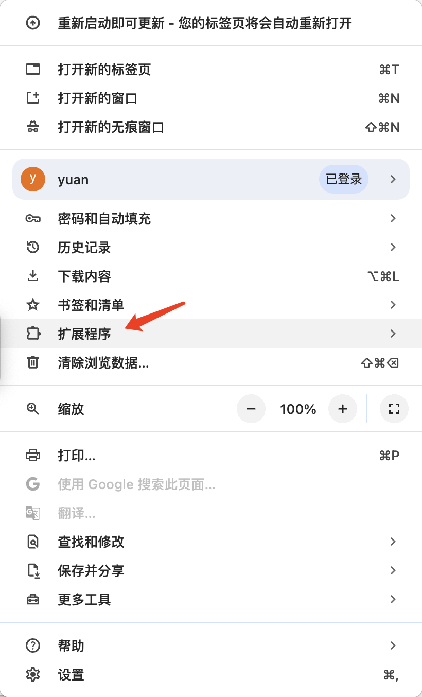

# GitLab link to Lark

一个浏览器插件，用于提供 GitLab 项目中关联的飞书项目 ID 转换为飞书链接。方便在 GitLab 项目中快速跳转查看飞书项目信息。
[飞书参考资料](https://bytedance.larkoffice.com/wiki/XusFwYp2ZiqltkkSTaJc7eMdnYb)

# 安装

## 源码安装

```bash
# node -v >= 18
# 默认使用 yarn 安装依赖，如未安装 yarn，可使用 npm 安装
# yarn
yarn build
# npm
npm run build
```

选择 dist 文件夹中的构建文件并在浏览器中安装它




## Chrome 商店安装

[应用商店](https://chromewebstore.google.com/detail/gitlab-link-to-lark/ocmkgfnifakgckfeofcoakiniljdjcfp)

# 使用

打开浏览器扩展管理页面，找到 GitLab link to Lark 插件，点击 Options，填写 GitLab 地址和飞书命名空间，点击提交


# Preview


